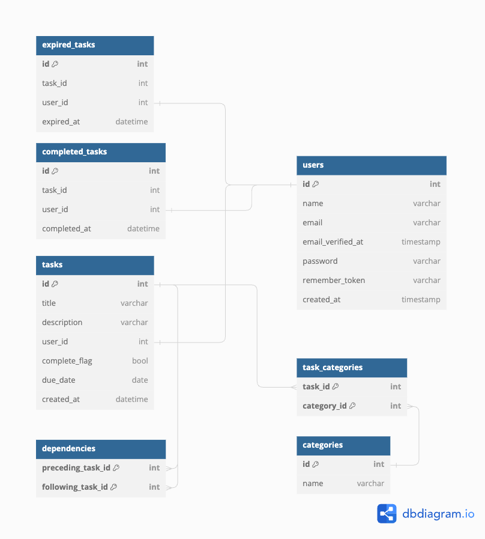

# Unsteady Worker

## 概要
Unsteady Workerは、個人用のタスク管理アプリです。「個人が認識しているタスクのほとんど大部分は達成されないタスクである」という観察に基づき、個人が消化できるタスクの量を増やすことを目的としています。このアプリは、以下の方法でユーザーの意思決定を補助します。

- タスク発生後3日を強制的に締切とし、todoリストを更新することで未達成タスクのスタックを抑制します。
- 未達成タスクを適切な頻度と難易度でリストに再追加し、ユーザーにタスクへの着手を促します。
- タスク間の依存関係を整理し、ユーザーが短期間で着手できる粒度に分割します。

このようにして、「達成されないタスク」に情報を追加し、ユーザーの取捨選択を補助します。

## 目次
- [概要](#概要)
- [特徴](#特徴)
- [動作方法](#動作方法)
- [使い方](#使い方)
- [作業進捗](#作業進捗)
- [使用技術](#使用技術)
- [ライセンス](#ライセンス)

## 特徴
- 未達成のタスクを流動させるように設計されています。
- 個人用を想定しているため、タスクは進捗状態を詳細に管理しません。
- タスクの締切を強制的に設定し、未達成タスクの再整理を促します。

## 動作方法(Mac)
プロジェクトのインストール手順を詳しく説明します。Docker Desktopをインストール済みであることを前提にしています。

1. プロジェクトのクローン
```zsh
git clone https://github.com/sukoyaka-fun/UnsteadyWorker.git
cd UnsteadyWorker
```
2. アプリの起動
```zsh
sail up -d
# 初回起動時のみデータベースのマイグレーション
sail artisan migrate
sail npm run dev
``` 

3. アプリへのアクセス
webブラウザで [http://localhost](http://localhost) に接続

4. アプリの終了
アプリ実行中のターミナル上で `ctrl+C`

下記コマンドでコンテナを終了する。
```zsh
sail down
```

## 作業進捗
データベースの設計、テーブル作成のマイグレーションをdocker環境で行いました。
### ER図


## 使用技術
- フロントエンド: React.js
- バックエンド:PHP, Laravelフレームワーク, Inertia(ReactとLaravelの連携)
- データベース: PostgreSQL
- 実行環境: Mac(Apple M1), docker

## ライセンス
このプロジェクトは [CCZ1.0](LICENSE) のもとでライセンスされています。

Laravelフレームワークは [MIT License](https://opensource.org/licenses/MIT) のもとでライセンスされています。
